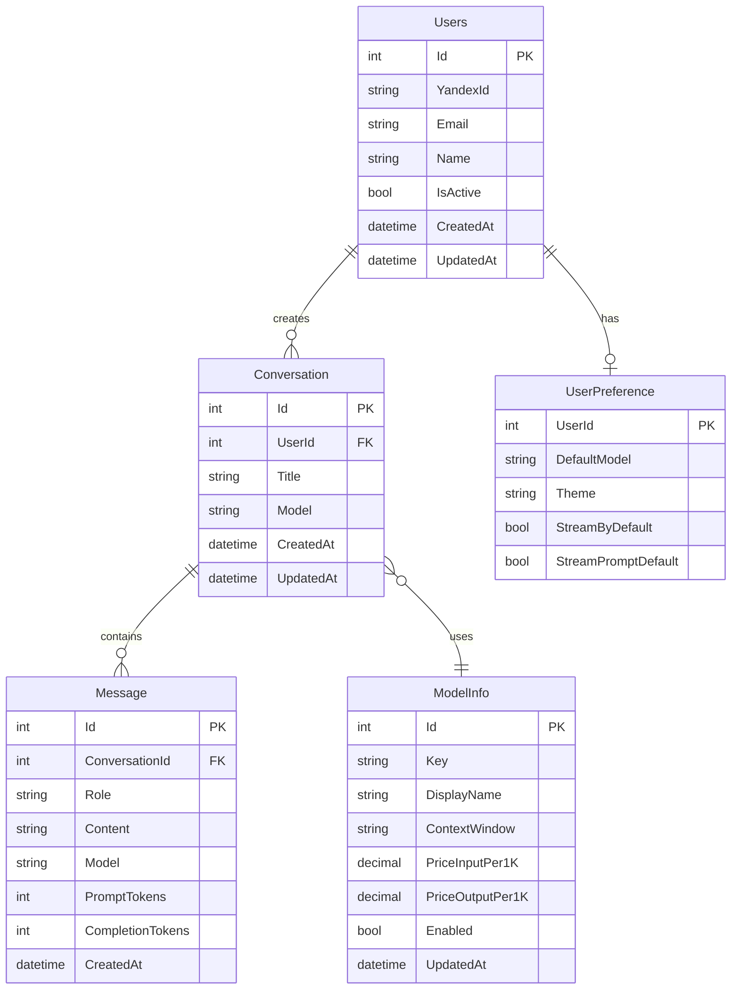

# Бэкенд

- Авторизация через Яндекс/VK
- Базовый чат: Поддержка текста на вход и выход
  - Провайдер: OpenRouter
  - Выбор модели: Модель из предзагатовленного списка
  - Хранение данных: сообщения и чаты (для каждого пользователя)
  - Суммаризация чата из первого сообщения

## Схема БД

## Стек

- .NET 9 Web API
- PostgreSQL + EF Core (Npgsql)
- Auth: Yandex OAuth 
- Кэш: Redis 
- Логирование: Serilog и Seq
- HTTP: HttpClientFactory (OpenRouter)
- Возможный Nginx
